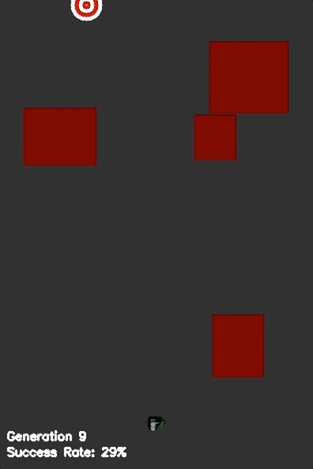

## Miscellaneous Fun with Code

Disclaimer: these are just one off projects for fun.  They might not optimized, readable, original, etc.  Some might include re-implementing something that someone already wrote better   ¯\\\_(ツ)\_/¯

### Subprojects:

#### [r\_fractal\_tree (R)](r_fractal_tree)

  

#### [r\_barnsley\_fern (R)](r_barnsley_fern)

  

#### [py\_smart\_moths (python)](py_smart_moths)

Homegrown genetic algorithm for 'moths' to learn how to reach a target through an obstacle course.

##### Example learning

  
  

  
  

